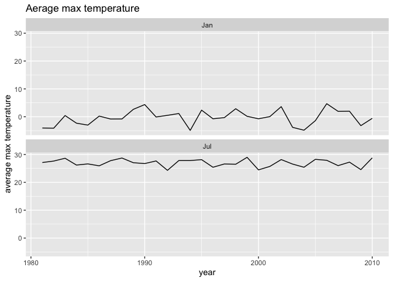
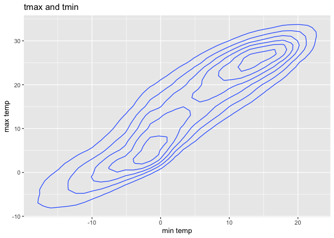
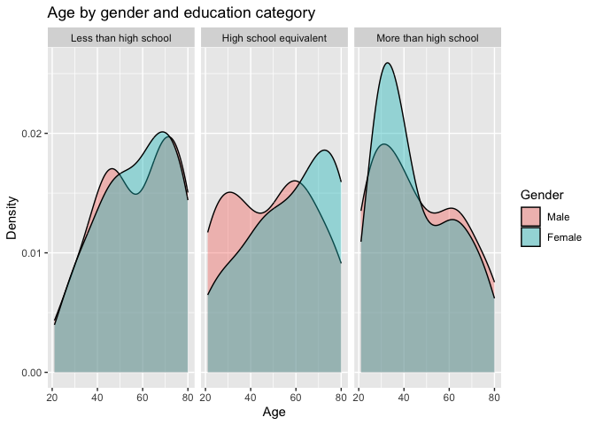
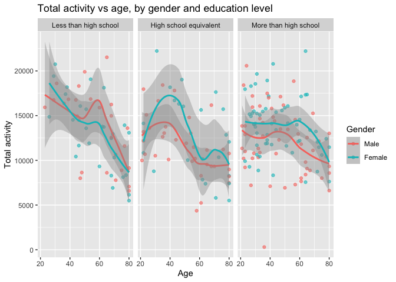
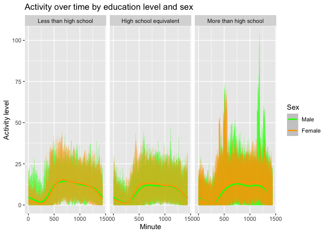

p8105_hw3_lah2231
================
2024-10-13

``` r
library(tidyverse)
```

    ## ── Attaching core tidyverse packages ──────────────────────── tidyverse 2.0.0 ──
    ## ✔ dplyr     1.1.4     ✔ readr     2.1.5
    ## ✔ forcats   1.0.0     ✔ stringr   1.5.1
    ## ✔ ggplot2   3.5.1     ✔ tibble    3.2.1
    ## ✔ lubridate 1.9.3     ✔ tidyr     1.3.1
    ## ✔ purrr     1.0.2     
    ## ── Conflicts ────────────────────────────────────────── tidyverse_conflicts() ──
    ## ✖ dplyr::filter() masks stats::filter()
    ## ✖ dplyr::lag()    masks stats::lag()
    ## ℹ Use the conflicted package (<http://conflicted.r-lib.org/>) to force all conflicts to become errors

``` r
library(ggplot2)
library(dplyr)
library(lubridate)
```

# Problem 1

``` r
devtools::install_github("P8105/p8105.datasets")
```

    ## Using GitHub PAT from the git credential store.

    ## Skipping install of 'p8105.datasets' from a github remote, the SHA1 (412759e3) has not changed since last install.
    ##   Use `force = TRUE` to force installation

``` r
library(p8105.datasets)
```

``` r
ny_weather <- ny_noaa
head(ny_weather)
```

    ## # A tibble: 6 × 7
    ##   id          date        prcp  snow  snwd tmax  tmin 
    ##   <chr>       <date>     <int> <int> <int> <chr> <chr>
    ## 1 US1NYAB0001 2007-11-01    NA    NA    NA <NA>  <NA> 
    ## 2 US1NYAB0001 2007-11-02    NA    NA    NA <NA>  <NA> 
    ## 3 US1NYAB0001 2007-11-03    NA    NA    NA <NA>  <NA> 
    ## 4 US1NYAB0001 2007-11-04    NA    NA    NA <NA>  <NA> 
    ## 5 US1NYAB0001 2007-11-05    NA    NA    NA <NA>  <NA> 
    ## 6 US1NYAB0001 2007-11-06    NA    NA    NA <NA>  <NA>

``` r
#View(ny_weather)
```

``` r
str(ny_weather)
```

    ## tibble [2,595,176 × 7] (S3: tbl_df/tbl/data.frame)
    ##  $ id  : chr [1:2595176] "US1NYAB0001" "US1NYAB0001" "US1NYAB0001" "US1NYAB0001" ...
    ##  $ date: Date[1:2595176], format: "2007-11-01" "2007-11-02" ...
    ##  $ prcp: int [1:2595176] NA NA NA NA NA NA NA NA NA NA ...
    ##  $ snow: int [1:2595176] NA NA NA NA NA NA NA NA NA NA ...
    ##  $ snwd: int [1:2595176] NA NA NA NA NA NA NA NA NA NA ...
    ##  $ tmax: chr [1:2595176] NA NA NA NA ...
    ##  $ tmin: chr [1:2595176] NA NA NA NA ...
    ##  - attr(*, "spec")=
    ##   .. cols(
    ##   ..   id = col_character(),
    ##   ..   date = col_date(format = ""),
    ##   ..   prcp = col_integer(),
    ##   ..   snow = col_integer(),
    ##   ..   snwd = col_integer(),
    ##   ..   tmax = col_character(),
    ##   ..   tmin = col_character()
    ##   .. )

``` r
colnames(ny_weather)
```

    ## [1] "id"   "date" "prcp" "snow" "snwd" "tmax" "tmin"

``` r
nrow(ny_weather)
```

    ## [1] 2595176

``` r
ncol(ny_weather)
```

    ## [1] 7

``` r
colSums(is.na(ny_weather))
```

    ##      id    date    prcp    snow    snwd    tmax    tmin 
    ##       0       0  145838  381221  591786 1134358 1134420

The NOAA dataset contains information about weather data such as
temperature and snowfall. The columns are called id, date, prcp, snow,
snwd, tmax, tmin. The dataset contains 2595176 rows and 7 columns. The
variables recorded are for example precipitation, snowfall, snow depth,
maximum temperature and minimum temperature. In addition to that there
are station identification numbers and dates of observations.

There are 3387623 missing values in the dataset overall. Precipitation
has 145838 missing values, snowfall has 381221 missing, snow depth has
591786 missing, maximum temperature has 1134358 missing, and minimum
temperature has 1134420 missing.

## Data cleaning

``` r
ny_weather_clean <- ny_noaa %>%
  mutate(
    year = year(date),
    month = month(date, label = TRUE),
    day = day(date),
    tmax = as.numeric(tmax) / 10,
    tmin = as.numeric(tmin) / 10,
    prcp = prcp / 10
  )
head(ny_weather_clean)
```

    ## # A tibble: 6 × 10
    ##   id          date        prcp  snow  snwd  tmax  tmin  year month   day
    ##   <chr>       <date>     <dbl> <int> <int> <dbl> <dbl> <dbl> <ord> <int>
    ## 1 US1NYAB0001 2007-11-01    NA    NA    NA    NA    NA  2007 Nov       1
    ## 2 US1NYAB0001 2007-11-02    NA    NA    NA    NA    NA  2007 Nov       2
    ## 3 US1NYAB0001 2007-11-03    NA    NA    NA    NA    NA  2007 Nov       3
    ## 4 US1NYAB0001 2007-11-04    NA    NA    NA    NA    NA  2007 Nov       4
    ## 5 US1NYAB0001 2007-11-05    NA    NA    NA    NA    NA  2007 Nov       5
    ## 6 US1NYAB0001 2007-11-06    NA    NA    NA    NA    NA  2007 Nov       6

I cleaned the data by turning the date into separate variables for year,
month and day and I changed the temperature from tenths of degrees
celsius to degrees celsius and precipitation from teths of milimeters to
mm.

## Common snowfall values

``` r
snowfall_common <- ny_weather_clean %>%
  filter(!is.na(snow)) %>% 
  group_by(snow) %>%
  summarize(count = n()) %>%
  arrange(desc(count))

head(snowfall_common)
```

    ## # A tibble: 6 × 2
    ##    snow   count
    ##   <int>   <int>
    ## 1     0 2008508
    ## 2    25   31022
    ## 3    13   23095
    ## 4    51   18274
    ## 5    76   10173
    ## 6     8    9962

The most common snowfall value is zero, which is probably the case
because it does not snow in New York on most days.

## Plotting

``` r
avg_tmax_simple <- ny_weather_clean %>%
  filter((month == "Jan") | (month == "Jul")) %>%
  filter(!is.na(tmax)) %>%
  group_by(year, month) %>%
  summarize(avg_tmax = mean(tmax)) %>%
  ungroup()
```

    ## `summarise()` has grouped output by 'year'. You can override using the
    ## `.groups` argument.

``` r
ggplot(avg_tmax_simple, aes(x = year, y = avg_tmax)) +
  geom_line() +
  facet_wrap(~month, ncol = 1) +
  labs(
    title = "Aerage max temperature",
    x = "year",
    y = "average max temperature"
  )
```

<!-- --> I
have made a two panel plot by taking the average mx temp in january and
july after removing missing tmax values. One can see that it correlates
that in some years if january was rather warm july was also rather warm.

## Temperature comparison plot

``` r
ggplot(ny_weather_clean, aes(x = tmin, y = tmax)) +
  geom_density_2d() +
  labs(
    title = "tmax and tmin",
    x = "min temp",
    y = "max temp"
  )
```

    ## Warning: Removed 1136276 rows containing non-finite outside the scale range
    ## (`stat_density2d()`).

<!-- -->

This plot shows the relationship between tmax and tmin using a 2D bin
plot using geom_bin2d because of the large amount of data.

# Problem 2

``` r
demographic_data <- read_csv("data/demographic_data.csv", skip = 4)
```

    ## Rows: 250 Columns: 5
    ## ── Column specification ────────────────────────────────────────────────────────
    ## Delimiter: ","
    ## dbl (5): SEQN, sex, age, BMI, education
    ## 
    ## ℹ Use `spec()` to retrieve the full column specification for this data.
    ## ℹ Specify the column types or set `show_col_types = FALSE` to quiet this message.

``` r
accelerometer_data <- read_csv("data/accelerometer_data.csv")
```

    ## Rows: 250 Columns: 1441
    ## ── Column specification ────────────────────────────────────────────────────────
    ## Delimiter: ","
    ## dbl (1441): SEQN, min1, min2, min3, min4, min5, min6, min7, min8, min9, min1...
    ## 
    ## ℹ Use `spec()` to retrieve the full column specification for this data.
    ## ℹ Specify the column types or set `show_col_types = FALSE` to quiet this message.

``` r
head(demographic_data)
```

    ## # A tibble: 6 × 5
    ##    SEQN   sex   age   BMI education
    ##   <dbl> <dbl> <dbl> <dbl>     <dbl>
    ## 1 62161     1    22  23.3         2
    ## 2 62164     2    44  23.2         3
    ## 3 62169     1    21  20.1         2
    ## 4 62174     1    80  33.9         3
    ## 5 62177     1    51  20.1         2
    ## 6 62178     1    80  28.5         2

``` r
head(accelerometer_data)
```

    ## # A tibble: 6 × 1,441
    ##    SEQN  min1  min2  min3  min4   min5   min6  min7   min8    min9  min10  min11
    ##   <dbl> <dbl> <dbl> <dbl> <dbl>  <dbl>  <dbl> <dbl>  <dbl>   <dbl>  <dbl>  <dbl>
    ## 1 62161 1.11  3.12  1.47  0.938 1.60   0.145  2.10  0.509   1.63   1.20   0.947 
    ## 2 62164 1.92  1.67  2.38  0.935 2.59   5.22   2.39  4.90    1.97   3.13   2.77  
    ## 3 62169 5.85  5.18  4.76  6.48  6.85   7.24   6.12  7.48    5.47   6.49   5.14  
    ## 4 62174 5.42  3.48  3.72  3.81  6.85   4.45   0.561 1.61    0.698  2.72   4.85  
    ## 5 62177 6.14  8.06  9.99  6.60  4.57   2.78   7.10  7.25   10.1    7.49   2.72  
    ## 6 62178 0.167 0.429 0.131 1.20  0.0796 0.0487 0.106 0.0653  0.0564 0.0639 0.0909
    ## # ℹ 1,429 more variables: min12 <dbl>, min13 <dbl>, min14 <dbl>, min15 <dbl>,
    ## #   min16 <dbl>, min17 <dbl>, min18 <dbl>, min19 <dbl>, min20 <dbl>,
    ## #   min21 <dbl>, min22 <dbl>, min23 <dbl>, min24 <dbl>, min25 <dbl>,
    ## #   min26 <dbl>, min27 <dbl>, min28 <dbl>, min29 <dbl>, min30 <dbl>,
    ## #   min31 <dbl>, min32 <dbl>, min33 <dbl>, min34 <dbl>, min35 <dbl>,
    ## #   min36 <dbl>, min37 <dbl>, min38 <dbl>, min39 <dbl>, min40 <dbl>,
    ## #   min41 <dbl>, min42 <dbl>, min43 <dbl>, min44 <dbl>, min45 <dbl>, …

I put the data from the website into csv files and loaded them. I
immediately took out the extra lines with other information from the
demographic data.

## Organizig Data

``` r
demographic_clean <- demographic_data %>%
  filter(age >= 21) %>%
  drop_na(sex, age, BMI, education)
```

I have now removed participants under 21 years of age and missing
demographic data

``` r
merged_data <- demographic_clean %>%
  inner_join(accelerometer_data, by = "SEQN")
```

And now I have merged on the seqn column

``` r
# Convert sex and education to factors
merged_data <- merged_data %>%
  mutate(
    sex = factor(sex, levels = c(1, 2), labels = c("Male", "Female")),
    education = factor(education, levels = c(1, 2, 3), 
                       labels = c("Less than high school", "High school equivalent", "More than high school"))
  )
```

As instructed I converted sex and education to the given factors as
instructed

``` r
head(merged_data)
```

    ## # A tibble: 6 × 1,445
    ##    SEQN sex      age   BMI education  min1  min2  min3  min4   min5   min6  min7
    ##   <dbl> <fct>  <dbl> <dbl> <fct>     <dbl> <dbl> <dbl> <dbl>  <dbl>  <dbl> <dbl>
    ## 1 62161 Male      22  23.3 High sch… 1.11  3.12  1.47  0.938 1.60   0.145  2.10 
    ## 2 62164 Female    44  23.2 More tha… 1.92  1.67  2.38  0.935 2.59   5.22   2.39 
    ## 3 62169 Male      21  20.1 High sch… 5.85  5.18  4.76  6.48  6.85   7.24   6.12 
    ## 4 62174 Male      80  33.9 More tha… 5.42  3.48  3.72  3.81  6.85   4.45   0.561
    ## 5 62177 Male      51  20.1 High sch… 6.14  8.06  9.99  6.60  4.57   2.78   7.10 
    ## 6 62178 Male      80  28.5 High sch… 0.167 0.429 0.131 1.20  0.0796 0.0487 0.106
    ## # ℹ 1,433 more variables: min8 <dbl>, min9 <dbl>, min10 <dbl>, min11 <dbl>,
    ## #   min12 <dbl>, min13 <dbl>, min14 <dbl>, min15 <dbl>, min16 <dbl>,
    ## #   min17 <dbl>, min18 <dbl>, min19 <dbl>, min20 <dbl>, min21 <dbl>,
    ## #   min22 <dbl>, min23 <dbl>, min24 <dbl>, min25 <dbl>, min26 <dbl>,
    ## #   min27 <dbl>, min28 <dbl>, min29 <dbl>, min30 <dbl>, min31 <dbl>,
    ## #   min32 <dbl>, min33 <dbl>, min34 <dbl>, min35 <dbl>, min36 <dbl>,
    ## #   min37 <dbl>, min38 <dbl>, min39 <dbl>, min40 <dbl>, min41 <dbl>, …

## Education by Gender Analysis

``` r
gender_education_table <- merged_data %>%
  group_by(education, sex) %>%
  summarize(count = n()) %>%
  pivot_wider(names_from = sex, values_from = count)
```

    ## `summarise()` has grouped output by 'education'. You can override using the
    ## `.groups` argument.

``` r
print(gender_education_table)
```

    ## # A tibble: 3 × 3
    ## # Groups:   education [3]
    ##   education               Male Female
    ##   <fct>                  <int>  <int>
    ## 1 Less than high school     27     28
    ## 2 High school equivalent    35     23
    ## 3 More than high school     56     59

I made a better looking table showing the number of men and women in
each education category. Most people had more than a high school
education. A few more women had more than high school in comparison to
men and a few more men had a high school equivalent in comparison to
women.

## Plotting age distribution by education category seperated by sex

``` r
ggplot(merged_data, aes(x = age, fill = sex)) +
  geom_density(alpha = 0.4) + 
  facet_wrap(~education) +
  labs(
    title = "Age by gender and education category",
    x = "Age",
    y = "Density",
    fill = "Gender"
  )
```

<!-- -->

I plotted the age distribution for men and women in each education
category. There seems to be a peak of 20-40 year old women with more
than high school education. I am not knowledgeable enough whatsoever in
this area to really comment on it but I guess it is consistent with
things I have read and not great, maybe there are issues in the way
school is structured causing more difficulties for men.

## Plotting Total activity

``` r
merged_data <- merged_data %>%
  rowwise() %>%
  mutate(total_activity = sum(c_across(starts_with("min")), na.rm = TRUE)) %>%
  ungroup()

ggplot(merged_data, aes(x = age, y = total_activity, color = sex)) +
  geom_point(alpha = 0.6) +
  geom_smooth() +
  facet_wrap(~education) +
  labs(
    title = "Total activity vs age, by gender and education level",
    x = "Age",
    y = "Total activity",
    color = "Gender"
  )
```

    ## `geom_smooth()` using method = 'loess' and formula = 'y ~ x'

<!-- -->

I created a total variable of activity for each person using rowwise
addition and starts_with to collect data from all columns. Afterwards I
ungrouped. I then made the plot showing total activity vs age, comparing
men to women, with separate panels for education levels. We find that
there is the most activity in the less than high school education group
at the age of around 21 - 30. Then there is a stronger decline than in
all other groups in the less than high school group. I am not an expert
in this field but my interpretation would be that people that did not
finish high school might work in more physically demanding jobs early on
and they might be more prone to injury due to these jobs which could be
leading to less activity at an older age. Contrarily, people with more
than high school education had a more consistent activity pattern
throughout their life, with surprisingly women being more active

## Plotting daytime activity

``` r
accelerometer_long <- merged_data %>%
  pivot_longer(cols = starts_with("min"), 
               names_to = "minute", 
               values_to = "activity") %>%
  mutate(minute = as.numeric(str_replace(minute, "min", "")))

ggplot(accelerometer_long, aes(x = minute, y = activity, color = sex)) +
  geom_line(alpha = 0.25) +
  geom_smooth() +
  facet_wrap(~education) +
  scale_color_manual(values = c("Male" = "green", "Female" = "orange")) +
  labs(
    title = "Activity over time by education level and sex",
    x = "Minute",
    y = "Activity level",
    color = "Sex"
  )
```

    ## `geom_smooth()` using method = 'gam' and formula = 'y ~ s(x, bs = "cs")'

<!-- -->

I put the data into long format, converted the minute labels to numbers
and made the plot that shows activity over time for each education
level, with green lines for men and orange lines for women. There is
more data the more than high school group and that most probably
explains the more intense coloring. Generally people seem to be more
active during the day, which is more consistent in third group, possibly
because it is more sedentary work. For the first two groups the lines
fall a little bit indicating more physically demanding jobs in the
morning. There are peaks in the morning and evening in the more than
high school group which might be indicating that that group of people
works out during those times. Such peaks do not exist so strongly in the
other groups.

# Problem 3

## Importing data and putting into one dataset

``` r
jan_2020 <- read_csv("data/Jan 2020 Citi.csv")
```

    ## Rows: 12420 Columns: 7
    ## ── Column specification ────────────────────────────────────────────────────────
    ## Delimiter: ","
    ## chr (6): ride_id, rideable_type, weekdays, start_station_name, end_station_n...
    ## dbl (1): duration
    ## 
    ## ℹ Use `spec()` to retrieve the full column specification for this data.
    ## ℹ Specify the column types or set `show_col_types = FALSE` to quiet this message.

``` r
jan_2024 <- read_csv("data/Jan 2024 Citi.csv")
```

    ## Rows: 18861 Columns: 7
    ## ── Column specification ────────────────────────────────────────────────────────
    ## Delimiter: ","
    ## chr (6): ride_id, rideable_type, weekdays, start_station_name, end_station_n...
    ## dbl (1): duration
    ## 
    ## ℹ Use `spec()` to retrieve the full column specification for this data.
    ## ℹ Specify the column types or set `show_col_types = FALSE` to quiet this message.

``` r
july_2020 <- read_csv("data/July 2020 Citi.csv")
```

    ## Rows: 21048 Columns: 7
    ## ── Column specification ────────────────────────────────────────────────────────
    ## Delimiter: ","
    ## chr (6): ride_id, rideable_type, weekdays, start_station_name, end_station_n...
    ## dbl (1): duration
    ## 
    ## ℹ Use `spec()` to retrieve the full column specification for this data.
    ## ℹ Specify the column types or set `show_col_types = FALSE` to quiet this message.

``` r
july_2024 <- read_csv("data/July 2024 Citi.csv")
```

    ## Rows: 47156 Columns: 7
    ## ── Column specification ────────────────────────────────────────────────────────
    ## Delimiter: ","
    ## chr (6): ride_id, rideable_type, weekdays, start_station_name, end_station_n...
    ## dbl (1): duration
    ## 
    ## ℹ Use `spec()` to retrieve the full column specification for this data.
    ## ℹ Specify the column types or set `show_col_types = FALSE` to quiet this message.

``` r
#head(jan_2020)

jan_2020 <- jan_2020 %>%
  mutate(month = "January", year = 2020)

jan_2024 <- jan_2024 %>%
  mutate(month = "January", year = 2024)

july_2020 <- july_2020 %>%
  mutate(month = "July", year = 2020)

july_2024 <- july_2024 %>%
  mutate(month = "July", year = 2024)

combined_data <- bind_rows(jan_2020, jan_2024, july_2020, july_2024)

# Display the first few rows of the combined data
head(combined_data)
```

    ## # A tibble: 6 × 9
    ##   ride_id    rideable_type weekdays duration start_station_name end_station_name
    ##   <chr>      <chr>         <chr>       <dbl> <chr>              <chr>           
    ## 1 4BE06CB33… classic_bike  Tuesday     15.3  Columbus Ave & W … E 53 St & Madis…
    ## 2 26886E034… classic_bike  Wednesd…     5.31 2 Ave & E 96 St    1 Ave & E 110 St
    ## 3 24DC56060… classic_bike  Friday       9.69 Columbia St & Riv… Grand St & Eliz…
    ## 4 EEDC10535… classic_bike  Sunday       7.00 W 84 St & Columbu… Columbus Ave & …
    ## 5 2CD4BD4CE… classic_bike  Friday       2.85 Forsyth St & Broo… Suffolk St & St…
    ## 6 E18682F9A… classic_bike  Sunday      25.5  Allen St & Hester… Atlantic Ave & …
    ## # ℹ 3 more variables: member_casual <chr>, month <chr>, year <dbl>

``` r
colSums(is.na(combined_data))
```

    ##            ride_id      rideable_type           weekdays           duration 
    ##                  0                  0                  0                  0 
    ## start_station_name   end_station_name      member_casual              month 
    ##                 43                207                  0                  0 
    ##               year 
    ##                  0

## Cleaning

``` r
cleaned_data <- combined_data %>% drop_na()
```

``` r
summary(cleaned_data)
```

    ##    ride_id          rideable_type        weekdays            duration      
    ##  Length:99253       Length:99253       Length:99253       Min.   :  1.002  
    ##  Class :character   Class :character   Class :character   1st Qu.:  5.587  
    ##  Mode  :character   Mode  :character   Mode  :character   Median :  9.823  
    ##                                                           Mean   : 13.836  
    ##                                                           3rd Qu.: 17.515  
    ##                                                           Max.   :238.780  
    ##  start_station_name end_station_name   member_casual         month          
    ##  Length:99253       Length:99253       Length:99253       Length:99253      
    ##  Class :character   Class :character   Class :character   Class :character  
    ##  Mode  :character   Mode  :character   Mode  :character   Mode  :character  
    ##                                                                             
    ##                                                                             
    ##                                                                             
    ##       year     
    ##  Min.   :2020  
    ##  1st Qu.:2020  
    ##  Median :2024  
    ##  Mean   :2023  
    ##  3rd Qu.:2024  
    ##  Max.   :2024

I imported the four citi bike datasets. The dataset for January 2020 had
9 columns and 12420 rows. The dataset for July 2020 had 9 columns and
21048 rows. The dataset for January 2024 had 9 columns and 18861 rows.
The dataset for July 2024 had 9 columns and 47156 rows.I combined all
the datasets into onde after adding a column to identify month and year
using bind_rows(). I checked for missing values and there were: 43
missing values in start_station_name and 207 missing values in
end_station_name. I removed lines with missing values. The cleaned
dataset had 99,253 rows and included ride duration values from 1 up to
238.780 minutes.

## Summary table rides by year + month and seperating by rider type

``` r
ride_summary <- cleaned_data %>%
  group_by(year, month) %>%
  summarise(
    member_rides = sum(member_casual == "member"),
    casual_rides = sum(member_casual == "casual")
  )
```

    ## `summarise()` has grouped output by 'year'. You can override using the
    ## `.groups` argument.

``` r
print(ride_summary)
```

    ## # A tibble: 4 × 4
    ## # Groups:   year [2]
    ##    year month   member_rides casual_rides
    ##   <dbl> <chr>          <int>        <int>
    ## 1  2020 January        11418          980
    ## 2  2020 July           15388         5625
    ## 3  2024 January        16705         2094
    ## 4  2024 July           36200        10843

I used group by to seperate by year, month and then summarise accorfing
to member_casual column

``` r
knitr::kable(ride_summary)
```

| year | month   | member_rides | casual_rides |
|-----:|:--------|-------------:|-------------:|
| 2020 | January |        11418 |          980 |
| 2020 | July    |        15388 |         5625 |
| 2024 | January |        16705 |         2094 |
| 2024 | July    |        36200 |        10843 |

In the table we can see that the number of members riding bikes rose
dramatically especially in the summer when comparing 2020 and 2024 (from
15388 to 36200). Generally there are more riders in the July than in
january which was to be expected due to weather conditions.

``` r
july_2024_data <- cleaned_data %>%
  filter(month == "July", year == 2024)

top_stations <- july_2024_data %>%
  group_by(start_station_name) %>%
  summarise(total_rides = n()) %>%
  arrange(desc(total_rides)) %>%
  slice_head(n = 5)

print(top_stations)
```

    ## # A tibble: 5 × 2
    ##   start_station_name       total_rides
    ##   <chr>                          <int>
    ## 1 Pier 61 at Chelsea Piers         163
    ## 2 University Pl & E 14 St          155
    ## 3 W 21 St & 6 Ave                  152
    ## 4 West St & Chambers St            150
    ## 5 W 31 St & 7 Ave                  145

``` r
knitr::kable(top_stations)
```

| start_station_name       | total_rides |
|:-------------------------|------------:|
| Pier 61 at Chelsea Piers |         163 |
| University Pl & E 14 St  |         155 |
| W 21 St & 6 Ave          |         152 |
| West St & Chambers St    |         150 |
| W 31 St & 7 Ave          |         145 |

I filtered out all the July 24 data. Then I grouped by start stations,
found the total rides, arranged them and took the top 5. The top
stations were start_station_name, total_rides.
